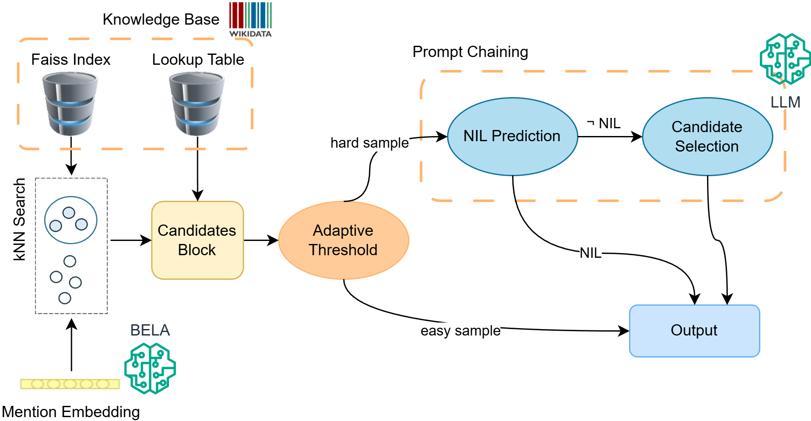

# MHEL-LLAMO

This is the official repository of the paper "[It’s All About the Confidence: An Unsupervised Approach for Multilingual Historical Entity Linking using Large Language Models](https://hal.science/hal-05440300/)".

This project aims to provide a benchmark for open-source LLMs in Historical Entity Linking by using an ensemble approach which combines a multilingual bi-encoder model, i.e. BELA, for candidate retrieval with prompt chaining for NIL prediction and candidate selection.




## Install Requirements

Due to dependency issues, the bi-encoder requires a different huggingface version than LLMs. For this reason, we suggest to create two different conda environments.

### Create BELA (bi-encoder) environment

```
conda create -n bela39 -y python=3.9 && conda activate bela39
pip install -r requirements_bela.txt
```

### Create LLM environment
```
conda create -n llm -y python=3.9 && conda activate llm
pip install -r requirements_llms.txt
```

## Perform Candidate Retrieval with BELA

```
conda activate bela39

python get_candidates.py --dataset_path ./test_data/HIPE_EN --output_dir ./results/HIPE_EN --top_k 50 --lang en
```

## Perform NIL Prediction and Candidate Selection with LLM and Compute Metrics
```
conda activate llm

python filter_and_prompt_chain.py \
--json_f results/HIPE_EN/candidates_test_top50_en.json \
--dataset_path ./test_data/HIPE_EN \
--output_dir ./results/HIPE_EN \ 
--threshold 21.24 \ # optional
--n_candidates 20 \ # optional
--model_id mistralai/Mistral-Small-24B-Instruct-2501 \
--hf_token your_secret_token # only with gated models

python eval.py --path_data ./test_data/HIPE_EN --path_results ./results/HIPE_EN
```

## Reproducing Benchmark Study

The following table reports the configuration which obtained the best F1 score on 4 benchmarks: HIPE-2020, NewsEye, AJMC and MHERCL. 

| Dataset \(Language\)    | Script             |  N. of Candidates         |    Threshold           |    Model            | F1    |
| ----------------------- | ------------------ | ------------------------- | ---------------------- | -----------------   | ----- |
| HIPE-2020 (de) | filter_and_prompt_chain.py | 30                         | 21.4 | mistralai/Mistral-Small-24B-Instruct-2501   | 0.62 |
| HIPE-2020 (en) | filter_and_prompt_chain.py | 20                         | \- | mistralai/Mistral-Small-24B-Instruct-2501   | 0.723 |
| HIPE-2020 (fr) | filter_and_prompt.py | 20                         | \- | mistralai/Mistral-Small-24B-Instruct-2501   | 0.692 |
| NewsEye (de) | filter_and_prompt_chain.py | 30                         | 25 | mistralai/Mistral-Small-24B-Instruct-2501   | 0.556 |
| NewsEye (fi) | filter_and_prompt_chain.py | 20                         | \- | LumiOpen/Llama-Poro-2-8B-Instruct   | 0.509 |
| NewsEye (fr) | filter_and_prompt_chain.py | 20                         | 21.35 | mistralai/Mistral-Small-24B-Instruct-2501   | 0.662 |
| NewsEye (sv) | filter_and_prompt_chain.py | 20                         | 25 | google/gemma-3-27b-it   | 0.521 |
| AJMC (de) | filter_and_prompt.py | 50                         | 21.5 | mistralai/Mistral-Small-24B-Instruct-2501   | 0.521 |
| AJMC (en) | filter_and_prompt.py | 50                         | \- | mistralai/Mistral-Small-24B-Instruct-2501   | 0.496 |
| HIPE-2020 (fr) | filter_and_prompt.py | 20                         | \- | mistralai/Mistral-Small-24B-Instruct-2501   | 0.636 |
| MHERCL (en) | filter_and_prompt_chain.py | 20                         | \- | mistralai/Mistral-Small-24B-Instruct-2501   | 0.7 |
| MHERCL (it) | filter_and_prompt_chain.py | 20                         | \- | mistralai/Mistral-Small-24B-Instruct-2501   | 0.698 |

All experiments were carried by using a list of candidates retrieved by BELA, containing labels, descriptions and other metadata in the language of the dataset. An example is available [here](results/HIPE_FR/candidates_test_top50_fr.json).

For reducing computational costs, we suggest using [mistralai/Ministral-8B-Instruct-2410](https://huggingface.co/mistralai/Ministral-8B-Instruct-2410) for competitive performances in English, French and German and [google/gemma-3-12b-it](https://huggingface.co/google/gemma-3-12b-it) for Swedish.

## Citation

TO BE UPDATED
